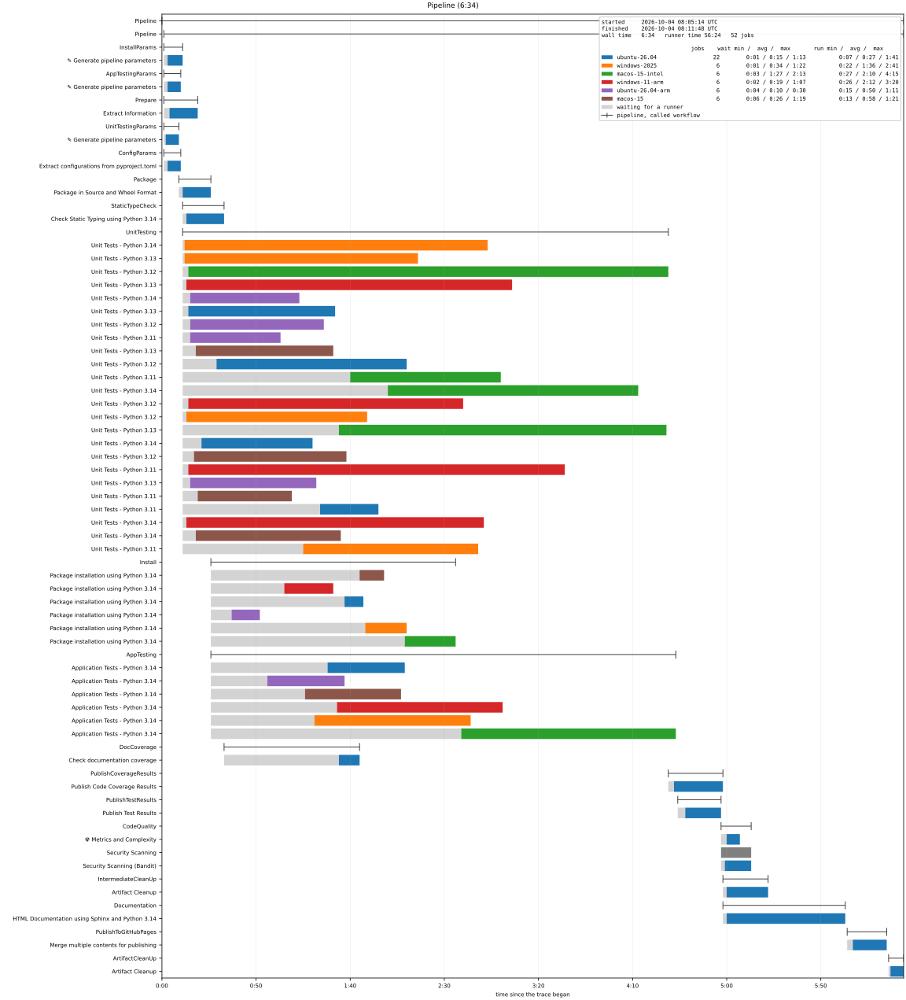

.. _VIS/PipelineTrace:

Pipeline Trace Diagram
######################

A pipeline run read into a **trace** - a timespan for the run, every called workflow, matrix, job and step - is written
as OpenTelemetry's OTLP/JSON, which trace viewers read, or drawn as a Gantt chart.

.. contents:: Contents of this page
   :local:
   :depth: 1

.. _VIS/PipelineTrace/Reading:

Reading a Run
*************

:class:`~pyTooling.GitHub.Tracing.WorkflowRunReader` reads a workflow run through the GitHub REST API, using the
standard library only:

.. code-block:: python

   from os import getenv
   from pathlib import Path
   from pyTooling.GitHub.Tracing import WorkflowRunReader

   reader = WorkflowRunReader("pyTooling/Actions", token=getenv("GITHUB_TOKEN"))
   trace = reader.ReadRun(34937615362)      # optionally: attempt=2
   trace.WriteJSONFile(Path("report/Pipeline.otlp.json"))

Inside a workflow, ``GITHUB_TOKEN`` with the ``actions: read`` permission suffices. A job can't see itself: it is
still running when it reads the run, so a timing job depends on every other job and runs last.

A request failing transiently - HTTP 429, 500, 502, 503 or 504, a timeout, or an unreachable API - is tried again,
``retries`` times (default: 3), after a pause of ``retryDelay`` seconds (default: 2), which doubles with every attempt
or lasts as long as a ``Retry-After`` header demands, up to a minute. HTTP 401, 403 and 404 fail at once.

:meth:`WorkflowRunTrace.FromJSON <pyTooling.GitHub.Tracing.WorkflowRunTrace.FromJSON>` does the conversion alone,
for a run and jobs that were fetched another way. It is a class method, so converting needs no reader and therefore
no token. It reads both payloads into a :class:`~pyTooling.GitHub.Pipeline` - see :ref:`DATA/PipelineRun` - and hands
that to :meth:`~pyTooling.GitHub.Tracing.WorkflowRunTrace.FromPipeline`, which is the entry point when the model
was built elsewhere. Reading the payloads is therefore the model's job, and a field GitHub doesn't document raises
:exc:`~pyTooling.GitHub.GitHubError` - as does an answer the reader itself can't read, so everything GitHub says
that can't be made sense of is one exception type. A request that *fails* is a
:exc:`~pyTooling.REST.RESTError`, because nothing about GitHub's answer was wrong - there wasn't one.

.. _VIS/PipelineTrace/Timespans:

Timespans and Attributes
************************

The run becomes the trace, and every timespan below it is marked by :attr:`~pyTooling.Tracing.CI.CI.Span.Kind` with a
member of :class:`~pyTooling.Tracing.CI.SpanKind`. Each kind is a class of its own - a
:class:`~pyTooling.Tracing.CI.JobSpan` sets ``ci.span.kind`` to ``job`` because that is what it is, and takes the
attributes of a job as parameters - so a reader states values and never a key, and a reader of another service
builds the same classes:

+--------------+------------------------------------------------------------------------------------------------------+
| Kind         | Timespan                                                                                             |
+==============+======================================================================================================+
| ``pipeline`` | The workflow run, from its start to its last update once it completed.                               |
+--------------+------------------------------------------------------------------------------------------------------+
| ``workflow`` | A called workflow: the jobs named ``Caller / Job`` are grouped below a timespan ``Caller``.          |
+--------------+------------------------------------------------------------------------------------------------------+
| ``matrix``   | A matrix: the jobs named ``Job (ubuntu-26.04, 3.14)`` are grouped below a timespan ``Job``, and the  |
|              | called workflows of ``Caller (3.14) / Job`` - a ``workflow`` each - below a timespan ``Caller``.     |
+--------------+------------------------------------------------------------------------------------------------------+
| ``queued``   | ``<job> (queued)``, the time a job waited for a runner, in front of the job.                         |
+--------------+------------------------------------------------------------------------------------------------------+
| ``job``      | A job, from its start to its completion.                                                             |
+--------------+------------------------------------------------------------------------------------------------------+
| ``step``     | A step that started, below its job.                                                                  |
+--------------+------------------------------------------------------------------------------------------------------+

Every timespan also carries the attributes of OpenTelemetry's semantic conventions for CI/CD, which
:class:`~pyTooling.Tracing.CI.OTLP` names as a namespace nested the way the keys are - so
:attr:`OTLP.CICD.Pipeline.Task.Run.ID <pyTooling.Tracing.CI.OTLP>` spells ``cicd.pipeline.task.run.id`` and the path
can be read to check the key. The values a result may take are :class:`~pyTooling.Tracing.CI.Result`, which are
those of the model's :class:`~pyTooling.CI.Outcome`, so a result is the element's outcome. What only GitHub
reports is named the same way by :class:`~pyTooling.GitHub.Tracing.GitHub`, e.g.
``github.conclusion`` beside the result it was mapped to. A job's timespan names its runner and the labels it was
requested by, so a renderer can group waiting times per operating system, and a matrix instance additionally lists the
values it was produced for in ``github.matrix.dimensions``.

A task is named the way GitHub reports it - ``Caller / Build (ubuntu-26.04)`` - while the timespan itself is named by
the part the model holds, so a timespan reads in the context its parents already give.

Each flavour builds itself from the model: :meth:`JobSpan.FromJob <pyTooling.GitHub.Tracing.JobSpan.FromJob>` takes
a :class:`~pyTooling.GitHub.Job` and produces the job's timespan, the waiting timespan in front of it, and a
timespan per step. So reading a service means mapping its model onto these classes, and everything else - the kinds,
the attribute keys, and skipping what the service doesn't report - is
:mod:`pyTooling.Tracing.CI`'s.

What the payloads *say* is the model's, including the two facts a timeline depends on: a group's elements come in
the order they were queued, and a job's times contain its steps, because GitHub reports both in whole seconds and a
step is sometimes reported as running outside the job holding it - see :ref:`DATA/PipelineRun`.

GitHub reports timestamps in whole seconds. A step shorter than a second lasts zero seconds, and an end reported a
second before its begin is moved to the begin.

.. _VIS/PipelineTrace/Gantt:

Gantt Chart
***********

pyTooling lays a trace out as a Gantt chart and draws it with matplotlib - see
:external+pyTool:ref:`pyTooling's rendering <TRACING/Render>`. :func:`~pyTooling.Tracing.Render.ciSpanFilter`
selects what a pipeline's chart shows:

.. code-block:: python

   from pyTooling.Tracing.Render            import GanttLayout, ciSpanFilter
   from pyTooling.Tracing.Render.Matplotlib import MatplotlibRenderer

   layout = GanttLayout(trace, spanFilter=ciSpanFilter())
   MatplotlibRenderer(layout).Write(Path("report/Pipeline.svg"))

* A row per job, below the rows of the called workflow and the matrix it belongs to. The time a job waited for a runner
  is drawn in light gray in front of the time it ran, colored per runner image.
* The legend carries the statistics per runner image: the number of jobs, and the shortest, average and longest
  waiting and running times.
* The steps are left out - a pipeline of 52 jobs has hundreds of them. ``excludeSteps=StepExclusion.Skipped`` shows
  the steps that ran, ``excludeSteps=False`` every step. Skipped jobs are left out too, unless
  ``excludeSkippedJobs=False``.
* ``MatplotlibRenderer(layout, collapsible=True)`` writes an SVG file whose rows of called workflows and jobs can be
  collapsed and expanded with a click.

The drawing needs the extra ``diagram`` (see :ref:`DEP/diagram`). The program draws the same chart with
``--gantt`` - see :ref:`CLI/Pipeline/Gantt`.

   A run of pyTooling.GitHub's own pipeline (`run 37187783003
   <https://github.com/pyTooling/pyTooling.GitHub/actions/runs/37187783003>`__), drawn as above.
